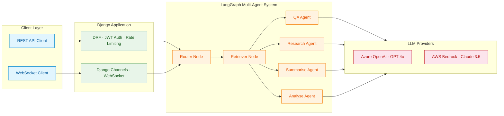
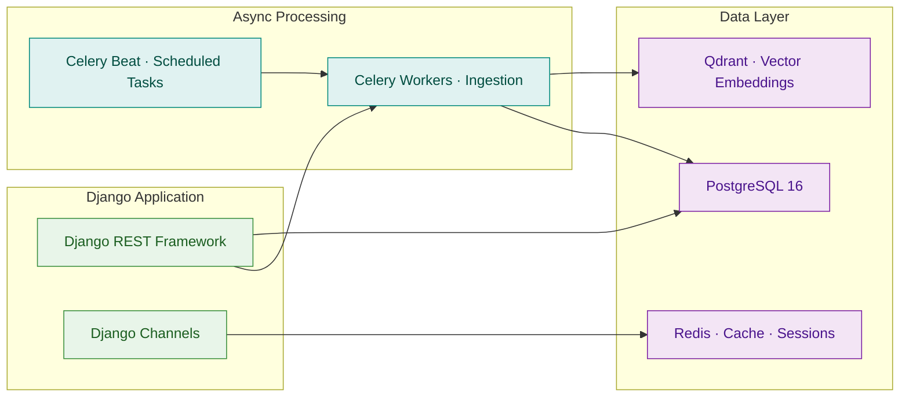
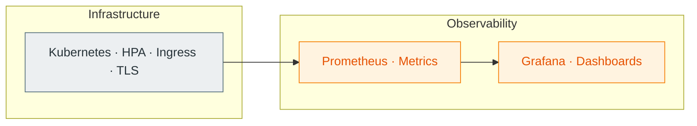

# DocuMind AI

**Intelligent Document Analysis Platform**

[](https://github.com/yourusername/documind-ai/actions/workflows/ci.yml)


A production-grade **RAG (Retrieval-Augmented Generation)** platform built with Django, LangChain, LangGraph, and Qdrant. Upload documents, ask questions, and get AI-powered answers with source citations — powered by a multi-agent architecture that routes queries to specialist agents.

---

## Architecture

### Request & Agent Flow



### Data & Async Processing



### Infrastructure & Monitoring



## Key Features

- **Multi-Agent RAG System** — LangGraph-powered workflow with intelligent routing to specialist agents (QA, Research, Summarisation, Analysis)
- **Hybrid Retrieval** — Dense vector search via Qdrant with re-ranking and contextual compression
- **Multi-Provider LLM** — Factory pattern supporting Azure OpenAI and AWS Bedrock with runtime switching
- **Real-Time Streaming** — WebSocket support via Django Channels for token-by-token streaming
- **Async Document Processing** — Celery workers handle document ingestion with retry logic and deduplication
- **Production Infrastructure** — Docker Compose for dev, Kubernetes manifests with HPA for production
- **Observability** — Prometheus metrics, Grafana dashboards, structured JSON logging, health checks
- **API-First Design** — OpenAPI/Swagger docs, JWT auth, rate limiting, API key management

## Demo

<!-- TODO: Replace these with actual screenshots from your running instance -->

> **Screenshots coming soon** — Run the project locally with `make up` and capture:
>
> | Screenshot | Description |
> |---|---|
> | `docs/screenshots/swagger.png` | Swagger UI showing all API endpoints |
> | `docs/screenshots/grafana.png` | Grafana dashboard with request metrics |
> | `docs/screenshots/qdrant.png` | Qdrant dashboard showing vector collections |
> | `docs/screenshots/websocket.png` | WebSocket streaming response in action |

<!--
Once you have screenshots, uncomment and use this format:

<p align="center">
  
  &nbsp;&nbsp;
  
</p>
<p align="center">
  
  &nbsp;&nbsp;
  
</p>
-->

## Tech Stack

| Layer | Technologies |
|---|---|
| **API** | Django 5.1, DRF, Django Channels, Daphne |
| **AI/ML** | LangChain, LangGraph, LangChain-OpenAI, LangChain-AWS |
| **Vector DB** | Qdrant (gRPC + REST) |
| **LLM Providers** | Azure OpenAI (GPT-4o), AWS Bedrock (Claude 3.5 Sonnet) |
| **Async** | Celery, Redis, Django Celery Beat |
| **Database** | PostgreSQL 16 |
| **Infra** | Docker, Kubernetes, Nginx Ingress, HPA |
| **Monitoring** | Prometheus, Grafana, django-prometheus |
| **Testing** | pytest, pytest-django, pytest-cov, factory-boy |

## Quick Start

### Prerequisites

- Docker & Docker Compose
- An Azure OpenAI or AWS Bedrock account

### 1. Clone & configure

```bash
git clone https://github.com/yourusername/documind-ai.git
cd documind-ai
cp .env.example .env
# Edit .env with your API keys
```

### 2. Start services

```bash
make build
make up
```

### 3. Run migrations & create admin

```bash
make migrate
make createsuperuser
```

### 4. Access the platform

| Service | URL |
|---|---|
| API | http://localhost:8000 |
| Swagger Docs | http://localhost:8000/api/docs/ |
| Admin | http://localhost:8000/admin/ |
| Health Check | http://localhost:8000/health/ |
| Prometheus | http://localhost:9090 |
| Grafana | http://localhost:3000 (admin/admin) |
| Qdrant Dashboard | http://localhost:6333/dashboard |

## API Endpoints

### Authentication
```
POST /api/v1/auth/register/          # Register new user
POST /api/v1/auth/token/             # Obtain JWT token
POST /api/v1/auth/token/refresh/     # Refresh JWT token
GET  /api/v1/auth/profile/           # Get user profile
```

### Documents
```
POST /api/v1/documents/upload/                    # Upload document
GET  /api/v1/documents/                           # List documents
GET  /api/v1/documents/<id>/                      # Document detail
GET  /api/v1/documents/<id>/chunks/               # List chunks
POST /api/v1/documents/collections/               # Create collection
GET  /api/v1/documents/collections/               # List collections
POST /api/v1/documents/collections/<id>/reindex/  # Reindex collection
```

### Conversations
```
POST /api/v1/conversations/chat/     # Send message (sync)
GET  /api/v1/conversations/          # List conversations
GET  /api/v1/conversations/<id>/     # Conversation with messages
WS   /ws/chat/                       # WebSocket streaming
WS   /ws/chat/<conversation_id>/     # WebSocket with context
```

### Analytics
```
GET /api/v1/analytics/usage/         # Usage summary
```

## WebSocket Protocol

Connect to `ws://localhost:8000/ws/chat/` and send:

```json
{
  "message": "What are the key findings?",
  "collection_id": "uuid-here",
  "agent_mode": "research"
}
```

Receive streaming events:

```json
{"type": "stream_start", "conversation_id": "..."}
{"type": "token", "content": "The key"}
{"type": "token", "content": " findings"}
{"type": "sources", "sources": [...]}
{"type": "stream_end", "latency_ms": 1234}
```

## LangGraph Agent Architecture

The multi-agent system uses a **Router → Retriever → Specialist** pattern:

1. **Router Node** — Analyses the query and routes to the optimal specialist agent
2. **Retriever Node** — Performs hybrid search (dense + keyword re-ranking) on Qdrant
3. **Specialist Agents**:
   - **QA Agent** — Direct factual answers with source citations
   - **Research Agent** — Deep multi-source synthesis and analysis
   - **Summarise Agent** — Structured document/section summaries
   - **Analyse Agent** — Comparative analysis with tables and insights

## Kubernetes Deployment

```bash
# Deploy to cluster
make k8s-deploy

# Resources created:
# - Namespace: documind
# - Deployments: api (3 replicas), celery-worker (2), celery-beat (1)
# - StatefulSets: postgres, qdrant (with PVCs)
# - Services: ClusterIP for all components
# - Ingress: nginx with TLS
# - HPA: Auto-scaling for api (2-10) and celery (1-5)
```

## Testing

```bash
# Run full test suite
make test

# Run locally
make test-local

# With coverage
pytest --cov=apps --cov=core --cov-report=html
```

<details>
<summary><strong>Project Structure</strong></summary>

```
├── config/                  # Django configuration
│   ├── settings/            # Split settings (base/dev/prod)
│   ├── urls.py              # Root URL config
│   ├── celery.py            # Celery app
│   └── asgi.py              # ASGI with Channels
├── apps/
│   ├── accounts/            # User auth, JWT, API keys
│   ├── documents/           # Upload, process, chunk, index
│   ├── conversations/       # Chat, WebSocket streaming
│   └── analytics/           # Usage tracking & metrics
├── core/
│   ├── llm/                 # LLM provider factory (Azure / Bedrock)
│   ├── vectorstore/         # Qdrant client with connection pooling
│   ├── rag/                 # Chunking strategies, hybrid retriever, pipeline
│   ├── agents/              # LangGraph state, nodes, tools, graph
│   └── middleware/          # Redis-backed rate limiter
├── k8s/                     # Kubernetes manifests (14 files)
│   ├── namespace.yaml
│   ├── configmap.yaml
│   ├── secrets.yaml
│   ├── *-deployment.yaml    # Django, Celery, Postgres, Redis, Qdrant
│   ├── *-service.yaml       # ClusterIP services
│   ├── ingress.yaml         # Nginx with TLS
│   └── hpa.yaml             # Horizontal Pod Autoscalers
├── monitoring/              # Prometheus & Grafana config
├── tests/                   # pytest suite (API, RAG, agents)
├── docs/                    # Architecture diagrams
├── docker-compose.yml       # 7-service local development stack
├── Dockerfile               # Multi-stage API container (non-root)
├── Dockerfile.celery        # Celery worker container
├── Makefile                 # 15 developer commands
└── .github/workflows/       # CI pipeline (lint → test → build)
```

</details>